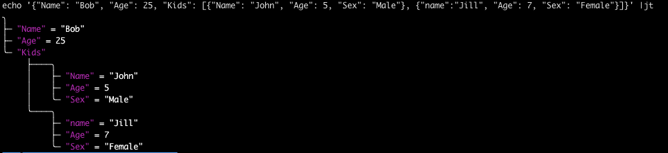

#jt

---
##json to tree 

`alias jt="python3 jt.py --quote=''  --value-colour=blue --style=5  --width=1"`

```console
[json] | jt [json_file] [json]

usage: jt.py [-h] [--style STYLE] [--null-char NULL] [--quote QUOTE] [--equals EQUALS] [--width WIDTH] [--key-colour {black,red,green,yellow,blue,magenta,cyan,white,none}] [--no-key-bold | --key-bold]
             [--key-inverted] [--value-colour {black,red,green,yellow,blue,magenta,cyan,white,none}] [--no-value-bold | --value-bold] [--value-inverted]
             [--other-colour {black,red,green,yellow,blue,magenta,cyan,white,none}] [--no-other-bold | --other-bold] [--other-inverted] [--display-type]
             [contents ...]

Print json tree

positional arguments:
  contents              file/json string

options:
  -h, --help            show this help message and exit
  --display-type        default=False

General style:
  --style STYLE         default=5
  --null-char NULL      default=None
  --quote QUOTE         default="""
  --equals EQUALS       default="="
  --width WIDTH         default=1

Key style:
  --key-colour {black,red,green,yellow,blue,magenta,cyan,white,none}
                        default=none
  --no-key-bold         default
  --key-bold
  --key-inverted        default=False

Value style:
  --value-colour {black,red,green,yellow,blue,magenta,cyan,white,none}
                        default=none
  --no-value-bold
  --value-bold          default
  --value-inverted      default=False

Other style:
  --other-colour {black,red,green,yellow,blue,magenta,cyan,white,none}
                        default=none
  --no-other-bold       default
  --other-bold
  --other-inverted      default=False

```



```
echo '{"Name": "Bob", "Age": 25, "Kids": ["John", "Jill"]}' |jt '[1,2,3]'
╮
├─ Name = Bob
├─ Age = 25
╰─ Kids
   ├─ John
   ╰─ Jill
╮
├─ 1
├─ 2
╰─ 3
```

```
jt file.json
╮
├─ university = Global Science Institute
├─ location
│  ├─ city = Techville
│  ╰─ country = Innovatia
├─ faculties
│  ├──╮
│  │  ├─ name = Engineering
│  │  ╰─ departments
│  │     ├──╮
│  │     │  ├─ name = Computer Science
│  │     │  ╰─ programs
│  │     │     ├──╮
│  │     │     │  ├─ name = Artificial Intelligence
│  │     │     │  ├─ courses
│  │     │     │  │  ├──╮
│  │     │     │  │  │  ├─ code = AI101
│  │     │     │  │  │  ├─ name = Introduction to AI
│  │     │     │  │  │  ╰─ topics
│  │     │     │  │  │     ├─ Machine Learning
│  │     │     │  │  │     ├─ Neural Networks
│  │     │     │  │  │     ╰─ AI Ethics
│  │     │     │  │  ╰──╮
│  │     │     │  │     ├─ code = AI202
│  │     │     │  │     ├─ name = Advanced AI Techniques
│  │     │     │  │     ├─ topics
│  │     │     │  │     │  ├─ Deep Learning
│  │     │     │  │     │  ├─ Reinforcement Learning
│  │     │     │  │     │  ╰─ Computer Vision
│  │     │     │  │     ╰─ prerequisites
│  │     │     │  │        ╰─ AI101
│  │     │     │  ╰─ labs
│  │     │     │     ├──╮
│  │     │     │     │  ├─ Lab1
│  │     │     │     │  ├─ Machine Learning Lab
│  │     │     │     │  ╰──╮
│  │     │     │     │     ├─ TensorFlow
│  │     │     │     │     ╰─ PyTorch
│  │     │     │     ╰──╮
│  │     │     │        ├─ Lab2
│  │     │     │        ├─ Robotics Lab
│  │     │     │        ╰──╮
│  │     │     │           ├─ ROS
│  │     │     │           ╰─ Gazebo
│  │     │     ╰──╮
│  │     │        ├─ name = Software Engineering
│  │     │        ╰─ courses
│  │     │           ╰──╮
│  │     │              ├─ code = SE101
│  │     │              ├─ name = Introduction to Software Engineering
│  │     │              ╰─ topics
│  │     │                 ├─ Software Design
│  │     │                 ├─ Version Control
│  │     │                 ╰─ Testing
│  │     ╰──╮
│  │        ├─ name = Electrical Engineering
│  │        ╰─ programs
│  │           ╰──╮
│  │              ├─ name = Circuit Design
│  │              ╰─ courses
│  │                 ╰──╮
│  │                    ├─ code = CD101
│  │                    ├─ name = Basics of Circuit Design
│  │                    ╰─ topics
│  │                       ├─ Analog Circuits
│  │                       ├─ Digital Circuits
│  │                       ╰─ PCB Design
│  ╰──╮
│     ├─ name = Science
│     ╰─ departments
│        ╰──╮
│           ├─ name = Physics
│           ╰─ programs
│              ╰──╮
│                 ├─ name = Quantum Mechanics
│                 ╰─ courses
│                    ╰──╮
│                       ├─ code = QM101
│                       ├─ name = Introduction to Quantum Mechanics
│                       ╰─ topics
│                          ├─ Wave Function
│                          ├─ Uncertainty Principle
│                          ╰─ Quantum Entanglement
╰─ research
   ├─ areas
   │  ├─ Sustainable Energy
   │  ├─ Quantum Computing
   │  ╰─ Nanotechnology
   ╰─ projects
      ╰──╮
         ├─ title = Quantum Computing for Energy Solutions
         ├─ participants
         │  ├──╮
         │  │  ├─ name = Dr. Alan Turing
         │  │  ╰─ role = Lead Scientist
         │  ╰──╮
         │     ├─ name = Dr. Lisa Meitner
         │     ╰─ role = Physicist
         ├─ funding = $2,000,000
         ╰─ objectives
            ├─ Develop quantum algorithms for energy optimization
            ╰─ Prototype a quantum simulation for new materials
 ```

```
jt error.json
JSON parsing error: Expecting ',' delimiter: line 31 column 27 (char 961)
{
  "university": "Global Science Institute",
  "location": {
    "city": "Techville",
    "country": "Innovatia"
  },
  "faculties": [
    {
      "name": "Engineering",
      "departments": [
        {
          "name": "Computer Science",
          "programs": [
            {
              "name": "Artificial Intelligence",
              "courses": [
                {
                  "code": "AI101",
                  "name": "Introduction to AI",
                  "topics": ["Machine Learning", "Neural Networks", "AI Ethics"]
                },
                {
                  "code": "AI202",
                  "name": "Advanced AI Techniques",
                  "topics": ["Deep Learning", "Reinforcement Learning", "Computer Vision"],
                  "prerequisites": ["AI101"]
                }
              ],
              "labs": [
                ["Lab1", "Machine Learning Lab", ["TensorFlow", "PyTorch"]],
                ["Lab2', "Robotics Lab", ["ROS", "Gazebo"]]
--------------------------^`
```

## Why?

A good json pretty printer for those just looking at the information or passing it on to a non-technical individual\
**This is the python version that was the driver for go lang version
Great accent to `jq`

## Why 2 versions?
- Why not?
- Maintains order from input json
- On parsing error, shows where in the json structure the error occurred

## How?
Renders out of order in style chosen

## What are the styles?
0-10 try them out or look at the code

## Improvements?
Testing on Linux and Windows

## State
- As Above, untested in Windows and Linux (todo)

## Notes/Troubleshooting:

## New

### 1.0
Turn a json object into a human-readable tree